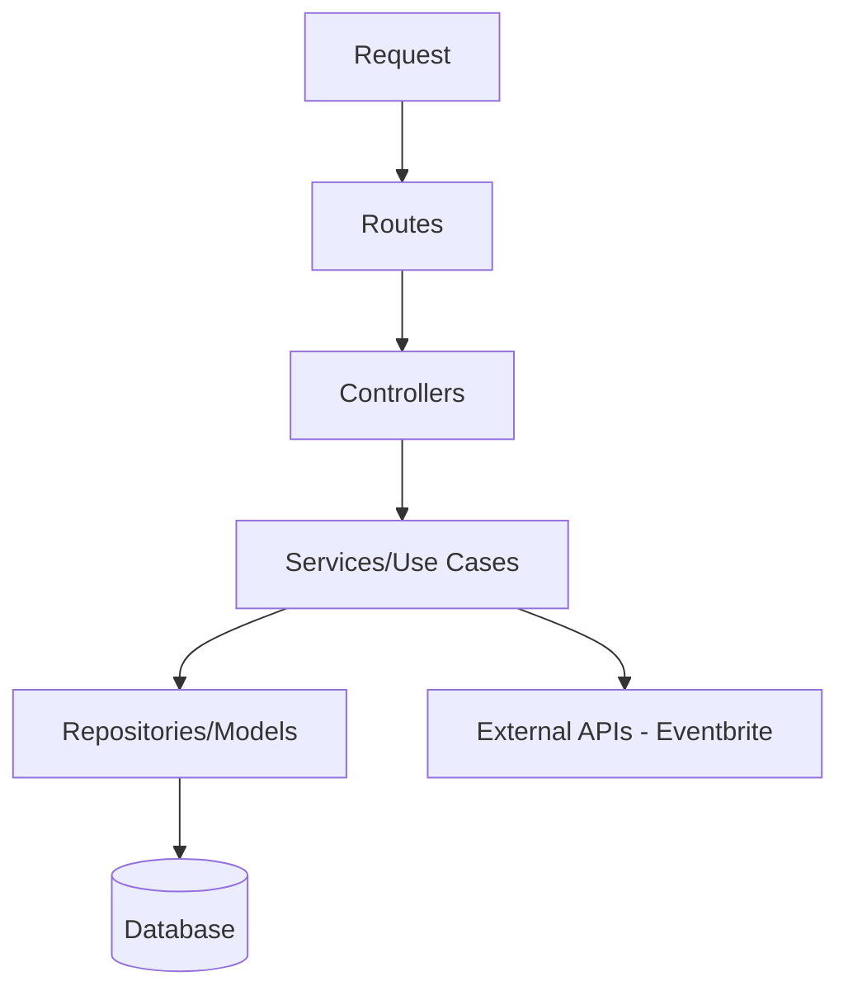

# Arquitectura Backend - API

## Diagrama Conceptual (UML)

## Capas

1. **Routes**: Definición de endpoints.
2. **Controllers**: Manejo de peticiones y respuestas HTTP.
3. **Services**: Lógica de negocio pura (independiente del framework).
4. **Repositories**: Acceso a datos.

## Principios aplicados

- **Single Responsibility**: Cada servicio hace una sola cosa.
- **Dependency Inversion**: Los controladores no dependen de implementaciones concretas de BD.
