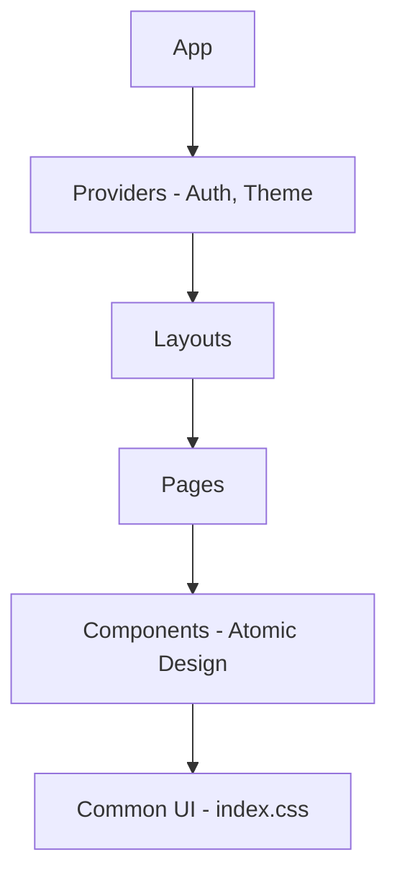

# Arquitectura Frontend - Web

## Diagrama de Componentes

## Estructura de Carpetas

- `/src/components`: UI modular y reutilizable.
- `/src/hooks`: Lógica de estado y side-effects.
- `/src/services`: Consultas a la API.
- `/src/styles`: Tokens de diseño y `index.css`.

## Estándares de Diseño

- Uso de variables CSS para consistencia.
- Mobile-first responsivity.
- No `any` permitido.
